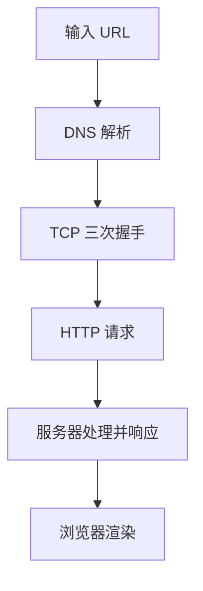

# Unit 14：从 URL 到页面展示（全流程）

> 目标：能够完整口述从输入 URL 到页面渲染的每一个关键节点。

## 一、核心流程图

## 二、详细步骤拆解

### 1. DNS 解析（寻找 IP 地址）
- **浏览器缓存**：先找浏览器有没有存过。
- **系统缓存**：找 hosts 文件。
- **递归查询**：向 DNS 服务器（如 114.114.114.114）查询。

### 2. TCP 三次握手（建立连接）
- **第一次**：客户端发送 SYN（你好，在吗？）。
- **第二次**：服务器发送 SYN + ACK（在的，你能听到我吗？）。
- **第三次**：客户端发送 ACK（可以，那我们开始吧！）。
- **目的**：确保双方的收发能力都正常。

### 3. HTTP 请求与响应
- 浏览器发送请求头（Method, Path, Headers）。
- 服务器返回响应头（Status Code, Content-Type）和响应体（HTML 源码）。

### 4. 浏览器渲染流程（面试核心）
1. **解析 HTML**：构建 **DOM 树**。
2. **解析 CSS**：构建 **CSSOM 树**（CSS 对象模型）。
3. **合并生成 Render Tree**（渲染树）：过滤掉 `display: none` 的节点。
4. **布局（Layout/Reflow）**：计算每个节点的几何信息（位置、大小）。
5. **绘制（Paint/Repaint）**：将像素绘制到屏幕上。

---

## 三、面试高频追问

### 1. 什么是回流（Reflow）和重绘（Repaint）？
- **回流**：几何属性改变（如宽高、位置、增加节点），需要重新计算布局。性能开销大。
- **重绘**：外观属性改变（如颜色、背景色），不需要重新计算布局。性能开销相对较小。
- **结论**：回流必引发重绘，重绘不一定引发回流。

### 2. 为什么建议 CSS 放头部，JS 放底部？
- **CSS 放头部**：为了尽快构建 CSSOM 树，让页面尽早开始渲染，避免“白屏”。
- **JS 放底部**：JS 执行会阻塞 HTML 解析。放底部可以保证 HTML 先解析完，让用户先看到页面。

---

## 四、自测练习

1. 能否在不看文档的情况下，口述出这 4 个大步骤？
2. 解释一下为什么 `display: none` 的元素不在渲染树中，而 `visibility: hidden` 的在？
